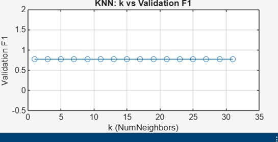

# ML-Final-Breast-Cancer
KNN, SVM, MLP, KMeans and SHAP analysis on Breast Cancer dataset
# ML-Final-Breast-Cancer

KNN, SVM, MLP, KMeans and SHAP analysis on Breast Cancer dataset

## Machine Learning Final Project
**Breast Cancer Classification with KNN, SVM, MLP, KMeans and SHAP (XAI)**

- **Course:** Machine Learning  
- **University:** Topkapı University  
- **Student:** Aslı Sertçelik  
- **Dataset:** Breast Cancer Wisconsin (Diagnostic)

---

## 📌 Project Overview
This project compares multiple machine learning models on the Breast Cancer Wisconsin dataset using **only the raw feature space** (no PCA/LDA).  
The workflow includes supervised classification, unsupervised clustering, hyperparameter optimization, and explainable AI (XAI) analysis using SHAP.

---

## 📊 Models Implemented

### Supervised Learning
- K-Nearest Neighbors (KNN)
- Support Vector Machine (SVM)
  - Linear Kernel
  - RBF Kernel
- Multi-Layer Perceptron (MLP)

### Unsupervised Learning
- KMeans Clustering

---

## ⚙️ Preprocessing
- Train / Validation / Test split: **70% / 10% / 20%**
- Stratified splitting
- StandardScaler (fit only on training data)
- Pipelines used to prevent data leakage
- Features containing NaN values removed

---

## 🔍 Hyperparameter Optimization
- **KNN:** n_neighbors, weights, distance metric  
- **SVM:** C, kernel type, gamma  
- **MLP:** hidden layers, activation, alpha, learning rate, early stopping  

Model selection was performed **only on validation performance**.

---

## 📈 Evaluation Metrics
Used for both validation and test sets:
- Accuracy
- Precision
- Recall
- F1-score
- ROC-AUC

---

## 📌 Final Model Performance (Test Set)

**Best Model:** SVM (RBF Kernel)

| Metric | Value |
|------|------|
| Accuracy | 0.9646 |
| Precision | 0.9467 |
| Recall | 1.0000 |
| F1-score | 0.9726 |
| ROC-AUC | 0.9812 |

---

## 📉 Visual Results

### Confusion Matrix (Test Set – SVM RBF)

### ROC Curve

### KNN – Validation Performance

### MLP Training Loss

### KMeans – Elbow Method

### KMeans – Silhouette Score

### SHAP – Global Feature Importance

---

## 🔬 Explainable AI (SHAP)
SHAP analysis was applied to the best-performing **SVM-RBF** model to interpret feature contributions.

- Global importance (mean |SHAP|)
- Identification of the most influential features
- Consistency b

## 📉 Visual Results

### Confusion Matrix (Test Set – SVM RBF)

### ROC Curve (Test Set)

### KNN – Validation F1 vs k

### MLP Training Loss Curve

### KMeans – Elbow Method

### KMeans – Silhouette Scores

### SHAP Global Feature Importance

